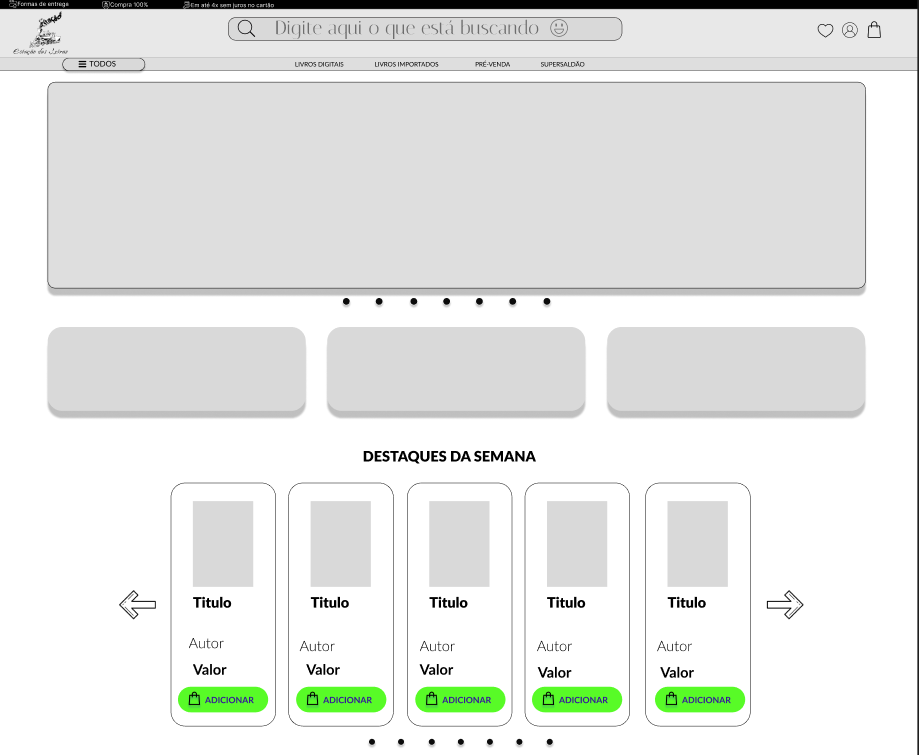

# 📚 Livraria Estação das Letras

Website institucional e comercial para uma pequena livraria, desenvolvido com foco em performance, organização visual e experiência do usuário. Este projeto é parte do meu portfólio e segue boas práticas de arquitetura front-end com **Next.js 14** (App Router), **Tailwind CSS** e componentes reutilizáveis.

---

## 🔥 Funcionalidades (MVP)

- 🛒 Catálogo de livros com seções de destaque e pré-venda  
- 🔍 Barra de busca inteligente  
- 🖼️ Carrossel de banners  
- 📱 Layout responsivo (Mobile First)  
- 🧩 Componentização com Tailwind  
- 💡 Design inspirado no Figma: [Layout inicial do website](https://www.figma.com/design/GKnfmx5hQBIZfT92QCvFRz/Livraria--Community-?node-id=0-1&p=f&t=vEDQ1C3caZHaMuDO-0)

---

## 🛠️ Tecnologias

- [Next.js 14](https://nextjs.org/)
- [Tailwind CSS](https://tailwindcss.com/)
- [TypeScript](https://www.typescriptlang.org/)
- [Radix UI](https://www.radix-ui.com/) *(futuramente)*
- [Lucide Icons](https://lucide.dev/)
- [Swiper.js](https://swiperjs.com/) *(para o carrossel)*

---

## 🚧 Em desenvolvimento

- Integração com backend
- Carrinho de compras (Zustand ou Context)
- Sistema de login/autenticação (em breve)

---

## 📁 Estrutura Inicial

```bash
src/
├── app/
├── components/
│ ├── Header.tsx
│ ├── BookCard.tsx
│ ├── Carousel.tsx
│ └── Navigation.tsx
├── styles/
│ └── globals.css
└── data/
└── books.ts
```

---

## 📸 Preview (wireframe)



---

## 🧠 Autor

Desenvolvido por **[Kadu Dev](https://www.linkedin.com/in/kaduesr/)** — estudante de Engenharia de Software, apaixonado por tecnologia, design e criação de experiências digitais.

---
